# `landscape_analysis.py` Function Flow Map

This document maps the runtime flow of [landscape_analysis.py](/C:/Users/User/Dropbox/EligMeta-main/landscape_analysis.py) and shows how the main pipeline, helper utilities, and LLM-driven planning functions connect.

## Main runtime flow

```mermaid
flowchart TD
    A["main()"] --> B["load_api_key()"]
    A --> C["_read_input()<br/>user_intent + comment"]
    A --> D["generate_landscape_selection_rules()"]
    D --> D1["OpenAI response -> rules list"]

    A --> E["build_landscape_plans_from_rules()"]
    E --> E1["infer_retriever_from_rules()"]
    E --> E2["generate_filter_plan_from_rule()<br/>for each rule"]

    A --> F["_read_input()<br/>condition + treatment overrides"]
    A --> G["fetch_trials_by_condition_and_treatment()"]
    A --> H["prefilter_study_df()"]

    A --> I["clear_registered_rules()"]
    A --> J["generate_filter_function_from_plan()<br/>for each plan"]
    J --> K["register_generated_python_function()"]
    K --> K1["register_llm_rule()"]

    A --> L["apply_registered_filters_with_fail_log()"]
    L --> L1["registered filter functions"]
    L1 --> L2["llm_parser()"]

    A --> M["Save CSV + JSON artifacts"]
    A --> N["fetch_trials_minimal_by_nct_ids()"]
    N --> N1["_os_pfs_only()"]

    A --> O["generate_landscape_table()"]
    O --> O1["_safe()"]
    O --> O2["_call_llm()"]
    O2 --> O3["llm_parser()"]

    A --> P["Write landscape_table.csv"]
```

## Stage-by-stage map

### 1. Startup and input

| Function | Role |
| --- | --- |
| `_script_dir()` | Resolves the script directory for local file paths. |
| `load_api_key()` | Reads `api_key.txt` and aborts if missing or empty. |
| `_read_input()` | Collects interactive user input with optional required validation. |
| `main()` | Orchestrates the full landscape analysis pipeline. |

### 2. Rule generation and planning

| Function | Called by | Role |
| --- | --- | --- |
| `generate_landscape_selection_rules()` | `main()` | Uses the LLM to turn the user intent into inclusion and exclusion rules. |
| `infer_retriever_from_rules()` | `build_landscape_plans_from_rules()` | Infers broad `condition` and `treatment` search terms from the rules. |
| `generate_filter_plan_from_rule()` | `build_landscape_plans_from_rules()` | Converts one natural-language rule into structured filter metadata. |
| `build_landscape_plans_from_rules()` | `main()` | Packages retriever inputs plus all filter plans into one dictionary. |

### 3. Trial retrieval and prefiltering

| Function | Called by | Role |
| --- | --- | --- |
| `fetch_trials_by_condition_and_treatment()` | `main()` | Pulls candidate studies from ClinicalTrials.gov. |
| `prefilter_study_df()` | `main()` | Removes studies based on built-in non-LLM filters such as status, phase, purpose, and result/publication availability. |

### 4. Dynamic filter generation and execution

| Function | Called by | Role |
| --- | --- | --- |
| `clear_registered_rules()` | `main()` | Resets the rule registry before new generated filters are loaded. |
| `generate_filter_function_from_plan()` | `main()` | Emits Python source code for a row-level filter function from one plan. |
| `register_generated_python_function()` | `main()` | `exec`s generated code and registers the resulting callable. |
| `register_llm_rule()` | `register_generated_python_function()` | Stores the callable in `llm_rule_registry`. |
| `apply_registered_filters_with_fail_log()` | `main()` | Applies registered filters in sequence and records the first rule each row fails. |
| `llm_parser()` | generated filter functions, `generate_landscape_table()`, `_call_llm()` | The core OpenAI-backed parser used throughout the pipeline. |

### 5. Result expansion and final table generation

| Function | Called by | Role |
| --- | --- | --- |
| `fetch_trials_minimal_by_nct_ids()` | `main()` | Re-fetches the filtered studies with result details needed for the final table. |
| `_os_pfs_only()` | `fetch_trials_minimal_by_nct_ids()` | Extracts only OS and PFS-related posted result blocks. |
| `_safe()` | `generate_landscape_table()` | Normalizes missing string-like fields to empty strings. |
| `_call_llm()` | `generate_landscape_table()` | Wraps `llm_parser()` and exposes long prompts when context length errors happen. |
| `generate_landscape_table()` | `main()` | Produces the final trial summary table and endpoint extractions. |

## Practical call chain from `main()`

1. `main()` loads the API key and user inputs.
2. `generate_landscape_selection_rules()` creates the plain-English rule list.
3. `build_landscape_plans_from_rules()` turns those rules into:
   - a retriever `condition`
   - a retriever `treatment`
   - a list of structured filter plans
4. `fetch_trials_by_condition_and_treatment()` retrieves candidate studies.
5. `prefilter_study_df()` removes obvious non-matches before LLM filtering.
6. For each generated plan:
   - `generate_filter_function_from_plan()` creates Python code
   - `register_generated_python_function()` loads the function into the registry
7. `apply_registered_filters_with_fail_log()` executes the registered filters row by row.
8. Intermediate CSV and JSON artifacts are written to `landscape_result/`.
9. `fetch_trials_minimal_by_nct_ids()` pulls richer details for the filtered NCT IDs.
10. `generate_landscape_table()` performs endpoint extraction and trial summarization.
11. The final `landscape_table.csv` is saved.

## Functions present but not on the active `main()` path

| Function | Current status |
| --- | --- |
| `apply_registered_filters()` | Simpler filter runner; not used because `main()` uses the failure-logging version. |
| `list_registered_rules()` | Debug helper for inspecting registered rules. |
| `call_llm()` | Generic OpenAI wrapper; currently bypassed by the concrete `llm_parser()` implementation. |
| `parse_llm_json_array()` | Utility for parsing LLM JSON array output. |
| `find_extension_study_ids()` | Optional LLM-based deduplication helper for extension studies. |
| `postfilter_remove_extensions()` | Wrapper around `find_extension_study_ids()`; not called by `main()`. |

## Notes

- The file defines stub versions of `llm_parser()` and `generate_landscape_table()` near the top, then later replaces them with full implementations. The later definitions are the ones used at runtime.
- The generated filter functions depend on global state:
  - `api_key_openai`
  - `llm_rule_registry`
  - `llm_rule_sources`
  - `FDA_approved_drugs_gastric`
- The final outputs currently go to `landscape_result/`, not the general-purpose `output/` folder you created for future runs.
