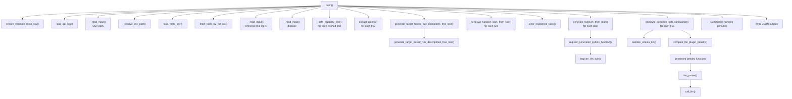

# `weighted_meta_analysis.py` Function Flow Map

This document maps the runtime flow of [weighted_meta_analysis.py](/C:/Users/User/Dropbox/EligMeta-main/weighted_meta_analysis.py) and shows how the input preparation, criteria extraction, LLM planning, generated penalty functions, and output stages connect.

## Main runtime flow

## Stage-by-stage map

### 1. Startup and input preparation

| Function | Role |
| --- | --- |
| `_script_dir()` | Resolves script-relative paths. |
| `load_api_key()` | Reads `api_key.txt` and exits if missing or empty. |
| `ensure_example_meta_csv()` | Creates the bundled example meta-analysis CSV if it does not exist. |
| `_read_input()` | Collects interactive user input with optional validation. |
| `_resolve_csv_path()` | Resolves a user-supplied CSV path against the script directory. |
| `load_meta_csv()` | Normalizes the user CSV into the required `NCTId`, `a`, `b`, `c`, `d`, `n_0`, `n_1` structure. |

### 2. Trial retrieval and eligibility text preparation

| Function | Called by | Role |
| --- | --- | --- |
| `fetch_trials_by_nct_ids()` | `main()` | Retrieves compact trial metadata from ClinicalTrials.gov for each NCT ID in the input CSV. |
| `_safe_eligibility_text()` | `main()` | Replaces missing eligibility text with a fallback string. |

### 3. LLM-based criteria extraction and rule generation

| Function | Called by | Role |
| --- | --- | --- |
| `extract_criteria()` | `main()` | Converts free-text eligibility text into structured criteria rows. |
| `generate_target_based_rule_descriptions_free_text()` | alias wrapper | Generates mismatch rules between the chosen target trial and prior trials. |
| `generate_target_based_rule_dscriptions_free_text()` | `main()` | Compatibility wrapper used by the main pipeline. |
| `generate_function_plan_from_rule()` | `main()` | Converts one mismatch rule into structured metadata for code generation. |

### 4. Generated penalty function lifecycle

| Function | Called by | Role |
| --- | --- | --- |
| `generate_function_from_plan()` | `main()` | Emits Python source code for one penalty function. |
| `register_generated_python_function()` | `main()` | Loads generated source and stores the callable in the registry. |
| `register_llm_rule()` | `register_generated_python_function()` | Adds the callable to `llm_rule_registry`. |
| `clear_registered_rules()` | `main()` | Resets the generated rule registry before a new run. |
| `list_registered_rules()` | debugging only | Prints the currently registered rules. |

### 5. Penalty computation and sanitization

| Function | Called by | Role |
| --- | --- | --- |
| `sanitize_text()` | `sanitize_criteria_list()` | Normalizes free-text values before comparison. |
| `sanitize_criteria_list()` | `compute_penalties_with_sanitization()` | Cleans structured criteria rows before penalty calculation. |
| `compute_llm_plugin_penalty()` | `compute_penalties_with_sanitization()` | Executes all registered penalty functions against one trial. |
| `compute_penalties_with_sanitization()` | `main()` | Sanitizes both trial and target criteria, then computes penalties. |
| `llm_parser()` | generated penalty functions | Extracts normalized values from structured criteria rows via the LLM. |
| `call_llm()` | `llm_parser()` | Low-level OpenAI request wrapper used by the parser. |

## Practical call chain from `main()`

1. `main()` ensures the default example CSV exists and loads the API key.
2. The user chooses a CSV path, then `load_meta_csv()` normalizes it.
3. `fetch_trials_by_nct_ids()` retrieves metadata for the NCT IDs in that CSV.
4. The user selects a reference trial and optionally a disease label.
5. Each trial’s eligibility text is cleaned via `_safe_eligibility_text()`.
6. `extract_criteria()` converts each eligibility text block into structured criteria.
7. `generate_target_based_rule_dscriptions_free_text()` creates mismatch rules between the target and prior trials.
8. For each mismatch rule:
   - `generate_function_plan_from_rule()` produces planning metadata
   - `generate_function_from_plan()` creates Python code
   - `register_generated_python_function()` loads the callable
9. `compute_penalties_with_sanitization()` scores every trial against the target trial.
10. `main()` sums numeric penalties and writes the JSON outputs.

## Functions present but mainly supporting internals

| Function | Current status |
| --- | --- |
| `_norm_col()` | Internal helper for CSV column name matching. |
| `_find_col()` | Internal helper used by `load_meta_csv()`. |
| `generate_target_based_rule_descriptions_free_text()` | Primary implementation called through a misspelled wrapper for backward compatibility. |

## Notes

- The main output directory is `meta_result/`.
- Generated penalty functions rely on the global registries:
  - `api_key_openai`
  - `llm_rule_registry`
  - `llm_rule_sources`
- The pipeline is target-trial driven: one selected reference trial becomes the standard, and the other trials are scored for mismatch against it.
